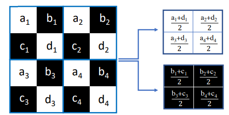
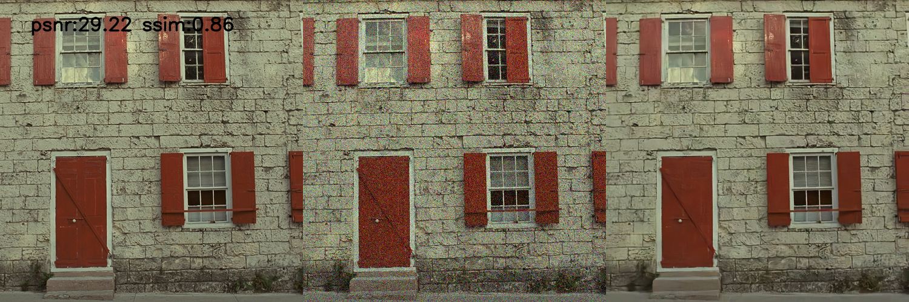

# Nb2Nb论文复现

## 一、论文原理

**对于假设一：** Neighbor2Neighbor使用ground truth相似的图片进行训练（Noise2Noise使用同一张图片的多个噪声图进行训练）。论文中存在推导，表明找到相似但不相同的含噪图像 y 和 z 时，可以训练降噪网络

**对于假设二：** 从含噪图像 y 采样出来的多个图像，被称为neighbors。作者构建了一个带约束的优化问题。

如下图所示是论文进行的具体流程：

#### 论文比较出众的点是论文针对相似图像（g1和g2）的采样方式：

​	论文中存在图示，把图像拆分为多个k×k 的 cell （下图中 k=2 ）。在每个 cell 中随机选两个像素，一个归 g1 ，另一个归 g2 ，这样就可以构建两个采样的子图。

​	**这种方式其实可以对比zero-shot N2N的采样方式：**

	## 二、论文结果复现

基于数据集Kodak24和McMaster进行复现，分别基于高斯噪声和泊松噪声进行测试，结果如下:

| dataset  | noise_σ    | PSNR   | SSIM |
| -------- | ---------- | ------ | ---- |
| Kodak24  | gauss_10   | 31.64  | 0.84 |
| Kodak24  | gauss_25   | 31.97  | 0.87 |
| Kodak24  | gauss_50   | 21.50  | 0.35 |
| Kodak24  | possion_10 | 20.60  | 0.38 |
| Kodak24  | possion_25 | 26.86  | 0.69 |
| Kodak24  | possion_50 | 31.31  | 0.85 |
| McMaster | gauss_10   | :31.99 | 0.86 |
| McMaster | gauss_25   | 32.28  | 0.88 |
| McMaster | gauss_50   | 21.69  | 0.37 |
| McMaster | possion_10 | 21.16  | 0.51 |
| McMaster | possion_25 | 27.16  | 0.72 |
| McMaster | possion_50 | :31.57 | 0.85 |

数据一览（左为原图，中为噪声图像，右为降噪图像）

